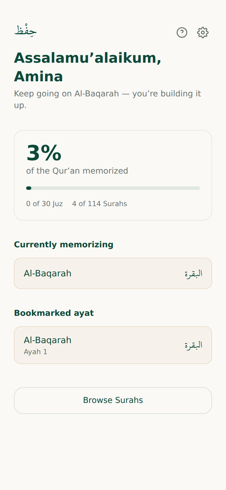
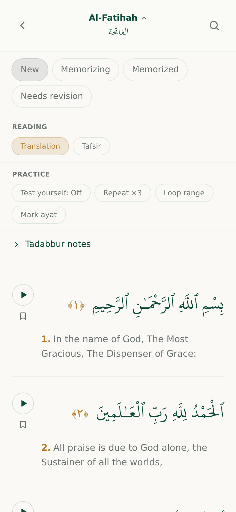

# Hifz

A calm, focused Qur'an **memorization** (hifz) companion — track what you've
memorized, what you're working on, and what needs revision. Built as an
installable, offline-first PWA. Sister app to [Daily Tilawah](https://github.com/danisheddie/dailyTilawah),
sharing its data layer and font pipeline but with its own identity and
purpose: a tracker, not a page-a-day reader.

No leaderboards, no streaks, no guilt-tripping — just a quiet place to keep
track of your hifz journey at your own pace.

**Live preview:** https://danisheddie.github.io/hifz/

<p float="left">
  
  
</p>

## Features

- **Status tracking, per surah or per ayah** — mark a surah `New` /
  `Memorizing` / `Memorized` / `Needs revision`, or select just a range of
  ayat (e.g. "the last 2 ayat of Al-Baqarah") when progress isn't uniform.
- **Dashboard** — a personalized, state-based summary: overall % memorized,
  Juz/surah counts, what's currently in progress, what's due for revision,
  and recently bookmarked ayat.
- **Audio** — single-ayah repeat and multi-ayah loop-range playback, with a
  bitrate-fallback chain across reciters.
- **Test yourself** — hide the Arabic text, or show just the first word, as
  a recall prompt; reveal on tap.
- **Tadabbur notes & tafsir** — a free-text reflection box per surah, and
  an on-demand tafsir lookup per ayah.
- **Revision tracker** — every surah (or ayah range) flagged for revision,
  ordered by longest since last reviewed, with a one-tap "mark confident."
- **Bookmarks & quick navigation** — bookmark any ayah and jump back to it
  from the dashboard, or search by ayah number within a surah.
- **Full offline support** — the entire Qur'an dataset is precached after
  one online visit; the app keeps working with no connection.
- **Optional cloud sync** — back up and sync progress across devices via a
  private sync code or Google sign-in, backed by a small Cloudflare Worker.
  Inert until configured; the app is fully functional without it.
- **i18n** — English, Bahasa Melayu, and Bahasa Indonesia.

## Tech stack

- [React 18](https://react.dev/) + [Vite](https://vitejs.dev/) + [Tailwind CSS](https://tailwindcss.com/) + [react-router-dom](https://reactrouter.com/)
- Local-first data layer with a live-API fallback (quran.com, alquran.cloud, islamic.network)
- A hand-rolled service worker for offline precaching (no Workbox)
- Optional [Cloudflare Workers](https://workers.cloudflare.com/) + KV backend for sync (`worker/`)

## Getting started

```bash
npm install

# One-time: fetch and build the local Qur'an dataset (public/data/)
npm run build-data

npm run dev      # local dev server
npm run build    # production build -> dist/
npm run preview  # serve the production build locally
npm run icons    # regenerate public/icons/ from assets/icon-master.svg
```

There's no test suite or lint script by design (see `CLAUDE.md`) — changes
are verified with `npm run build` and manual/scripted browser checks.

## Project structure

```
src/
  components/   UI screens and pieces (SurahDetail, Home, Bookmarks, ...)
  utils/        data layer, storage, sync, i18n, theming
public/
  data/         generated Qur'an dataset (npm run build-data)
  sw.js         offline service worker
scripts/        data-build and icon-generation scripts
worker/         optional Cloudflare Worker + KV backend for cloud sync
```

See `CLAUDE.md` for the full architecture notes, data model, and build
history — it's the living design doc this project has been built from.

## Deployment

- **Cloudflare Pages** (intended production target): `npm run build`,
  publish `dist/`. SPA routing is handled by `public/_redirects`.
- **GitHub Pages** (temporary preview, auto-deployed by
  `.github/workflows/deploy.yml` on every push): https://danisheddie.github.io/hifz/

## Cloud sync backend (optional)

`worker/` is a small Cloudflare Worker + KV store for the optional "Back up
& sync" feature. It's inert until deployed — see `worker/DEPLOY.md` for
setup. Without it, everything still works fully offline via localStorage.

## License

No license file yet — all rights reserved by default. Open an issue if
you'd like to use this code and want a license added.
